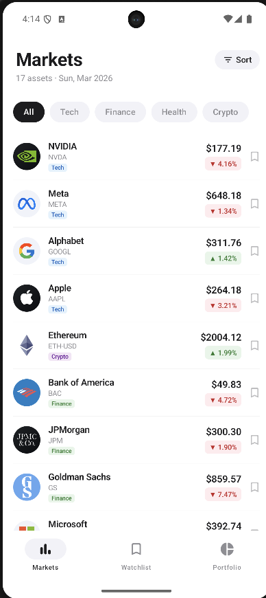
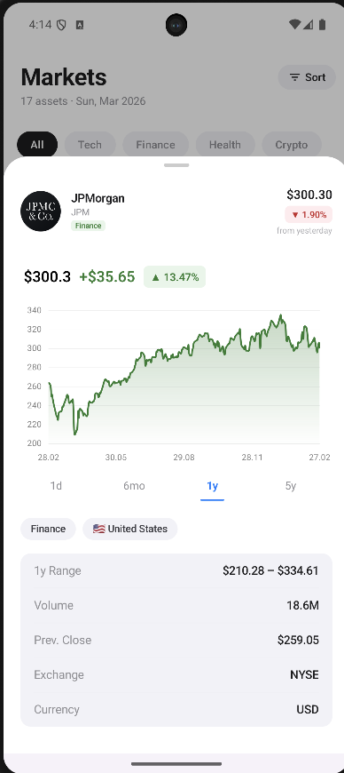
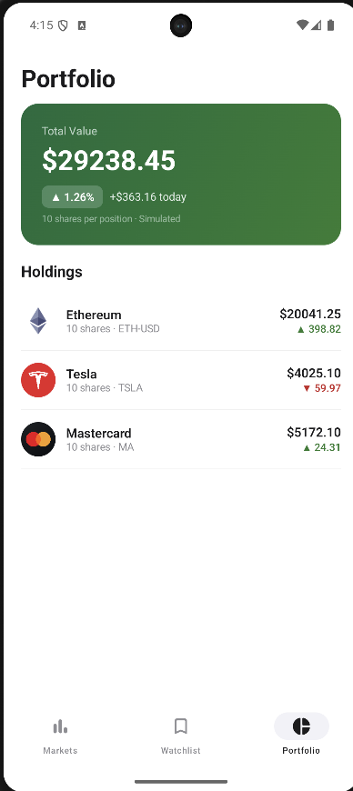

# Ticker Watch

> **This is a prototype.** The current version demonstrates the core UI and architecture. The full vision of the app includes many more features listed below in the roadmap.

An Android stock market tracker built with Jetpack Compose, featuring real-time prices, interactive charts, watchlist management, and a simulated portfolio.

## Screenshots

| Markets | Stock Detail | Portfolio |
|---------|-------------|-----------|
|  |  |  |

## Features

### Markets
- Live prices and sparkline charts for stocks and crypto
- Sector filter chips: All, Tech, Finance, Health, Crypto
- Sort by: Default, Name A–Z, Price (high to low), Change %, By Sector
- Bookmark any stock to your watchlist

### Watchlist
- Grid of bookmarked stocks
- Persisted in local Room database
- Tap any card to open the detail view

### Portfolio
- Simulated holdings based on your watchlist
- Summary card showing total value and daily P&L
- Tap any holding to open the detail view

### Stock Detail
- Interactive line chart powered by MPAndroidChart library
- Time range selector: 1D · 6M · 1Y · 5Y
- Price, change %, volume, and company info

## Supported Tickers

> These are the tickers currently supported. The stock list will grow richer in future versions.

| Sector | Symbols |
|--------|---------|
| Technology | AAPL, MSFT, AMZN, GOOGL, META, NVDA, TSLA, AMD, INTC, IBM |
| Finance | V, MA, JPM, BAC, GS |
| Crypto | BTC-USD, ETH-USD |

## Tech Stack

| Layer | Technology |
|-------|-----------|
| UI | Jetpack Compose + Material 3 |
| Architecture | MVVM + Hilt DI |
| Networking | Retrofit + Gson (Yahoo Finance API) |
| Database | Room (watchlist persistence) |
| State | Kotlin Flow + StateFlow |
| Charts | MPAndroidChart v3.1.0 |

## Requirements

- Android API 35+
- Internet connection

## What I Learned

This project was my deep dive into **Jetpack Compose** and **Material 3** after coming from an XML/View-based background.

- **Thinking in composables** — breaking UI into small, reusable functions instead of inflating layouts. Getting comfortable with the idea that the UI is just a function of state.
- **State hoisting** — understanding when to keep state local vs. lifting it up to a ViewModel, and how `StateFlow` + `collectAsState()` drives reactive UI updates without boilerplate.
- **Material 3 components** — working with `ModalBottomSheet`, `FilterChip`, `NavigationBar`, and `Scaffold`. Learning when to use Material defaults vs. when to build custom layouts from scratch.
- **Design tokens** — creating `AppColors`, `AppDimens`, and `AppType` objects to replace magic numbers and keep the UI consistent across screens.
- **Interop** — embedding Compose inside a Fragment (`ComposeView`) while migrating gradually from the legacy View system.
- **Composable independence** — learned to avoid injecting the ViewModel directly into composables. Instead, composables receive only the state and callbacks they need, keeping them decoupled, reusable, and easier to preview.

## Roadmap

The following features are planned for future versions:

- **Real-time stock tracking** — live price streaming with WebSocket or polling, replacing the current snapshot-based approach
- **Advanced stock analytics** — high/low within a selected range, volatility metrics
- **Stock news feed** — latest headlines and articles per ticker, pulled from a financial news API
- **ML price prediction** — on-device machine learning model to forecast short-term price trends based on historical data
- **Advanced portfolio simulation** — model recurring investments (daily, weekly, or monthly fixed amounts) to calculate real profit/loss over time, including cost averaging and return on investment
- **JSON-based ticker registry** — replace the current hardcoded enums with a comprehensive JSON file listing all known tickers, making it easy to add new stocks and crypto without touching the code
- **AI-generated app logo** — the final app icon will be designed with an AI image generation tool and displayed on the splash screen, replacing the current placeholder

## Setup

1. Clone the repository
2. Open in Android Studio
3. Run on a device or emulator with API 35+